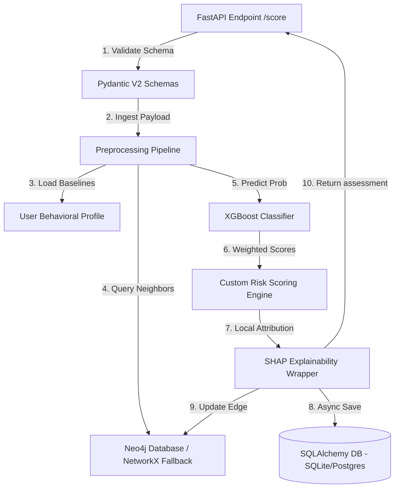

# 🛡️ AI Fraud Detection & Risk Intelligence Platform

A production-grade, end-to-end financial fraud detection platform combining real-time machine learning (XGBoost/Random Forest), Explainable AI (SHAP), multi-dimensional user behavioral profiling, entity relationship network graphs (NetworkX), and **strict User Role-Based Access Control (RBAC)** with 100% disjoint role workspaces.

---

## 🏗️ System Architecture & Data Flow

The platform is designed around a decoupled, low-latency scoring pipeline:



---

## 🌟 Key Engineering Highlights

### 1. User Role-Based Access Control (RBAC) & Disjoint Workspaces
- **Cryptographic OAuth2 JWT Security**: Secures all API routes and dashboard pages with role validation (`CO-`, `AN-`, `AU-`).
- **100% Disjoint Worksite Isolation**:
  - **Analyst (`AN-7025`)**: Real-Time Risk Evaluation Center, Risk Factor Attribution, Entity Network Desk, Case Management Workspace.
  - **Auditor (`AU-5265`)**: Executive Risk & Value Analytics, Model Health & Integrity, PDF & Multi-Sheet Excel Compliance Reports.
  - **Compliance Officer (`CO-9921`)**: Traffic Ingestion & Volume Load Desk, Threat Intelligence Registry, Governance & Audit Ledgers.

### 2. Dual-Engine Risk Scoring
- **ML Classifier**: Calibrated XGBoost & Random Forest pipelines engineered for real-time probability outputs. Includes unsupervised Isolation Forests for zero-day threat detection.
- **Business Rule Heuristics**: Custom scoring engine combining **Amount Risk**, **Frequency Risk**, **Location Risk**, and **Behavior Risk** into a unified score ($0 - 100$) mapped to Low, Medium, High, and Critical buckets.
- **Max-Pool Override**: Weighted aggregations are protected by a max-pool coefficient to prevent critical sub-risk spikes from being diluted.

### 3. Multi-Dimensional User Behavioral Profiling
- Tracks individual baseline vectors for all users (fit from training data or updated dynamically):
  - Geographic preferred countries/cities.
  - Device fingerprint baselines.
  - Typical hours of activity.
  - Velocity/frequency intervals.
- Computes deviations (such as Z-scores for amounts or unseen device flags) which feed directly into sub-risk overrides.

### 4. Entity Graph Fraud Analysis
- Models relationships as a multi-partite network connecting **Users (`usr_...`)**, **Devices (`dev_...`)**, **Cards (`card_...`)**, and **Merchants (`merch_...`)** via transaction edges.
- Detects complex threat patterns:
  - **Card Sharing**: Credit cards linked to $>1$ user accounts (account takeover/compromised cards).
  - **Device Sharing**: Devices linked to $>2$ user accounts (fraud rings/botnets).
  - **Fraud Rings**: Tightly connected components with high fraud density.

### 5. Explainable AI (XAI) & Dynamic Reporting
- Standard SHAP explanations run too slowly for real-time APIs. This platform utilizes `shap.TreeExplainer` cached directly on the compiled tree structures to deliver attributions in **sub-10ms**.
- Generates automated, downloadable **Executive PDF & Multi-Sheet Excel Reports** for compliance audits.

---

## 📂 Project Directory Structure

```text
AI Fraud Detection System/
├── config/                  # Configuration settings files
├── data/
│   ├── processed/           # Stratified train/test CSV partitions
│   └── raw/                 # Ingested transactions datasets
├── docker/                  # Stage-hardened multi-stage Dockerfiles
│   ├── api.Dockerfile
│   ├── dashboard.Dockerfile
│   └── docker-compose.yml
├── models/
│   └── registry/            # Serialized ML models, profiles, and graphs
├── src/
│   ├── api/                 # FastAPI routes, schemas, and security
│   │   ├── middleware/      # Auth security and telemetry handlers
│   │   ├── routers/         # Analytics, models, and transactions endpoints
│   │   └── schemas/         # Pydantic v2 validation models
│   ├── dashboard/           # Streamlit pages and HTTP clients
│   ├── database/            # SQLAlchemy models, sessions, and CRUD operations
│   ├── features/            # Profiling engine, graph analysis, and pipeline
│   └── models/              # ML training, scoring engine, and SHAP explainer
└── tests/                   # 100% clean Pytest suite (unit/integration)
```

---

## 🚀 Getting Started

### 1. Local Setup
Ensure you have Python 3.11+ installed.

```powershell
# Clone the repository and navigate to root
cd "AI Fraud Detection System"

# Initialize virtual environment
python -m venv .venv
.\.venv\Scripts\activate

# Install requirements
pip install -r requirements.txt
```

### 2. Environment Configuration
Create a `.env` file in the root directory:

```env
ENVIRONMENT=development
LOG_LEVEL=INFO
API_KEY=fraud_dev_sec_key
DATABASE_URL=sqlite+aiosqlite:///data/fraud_detection_db.db

# Graph Database (Optional - falls back to local NetworkX if omitted)
NEO4J_URI=bolt://localhost:7687
NEO4J_USER=neo4j
NEO4J_PASSWORD=secret_pass
```

### 3. Run Pipeline (Fit Baselines & Graph)
Trains the machine learning layers, fits user baseline profiles, constructs the baseline entity graph, and versions processed datasets:

```powershell
python -m src.features.pipeline
```

### 4. Run Tests
Execute the format checks and unit/integration test suites:

```powershell
# Code format check
black --check src/ tests/
ruff check src/ tests/

# Database Migrations (Alembic)
# Apply outstanding database schema updates
alembic upgrade head

# Execute tests
python -m pytest
```

### 5. Start the Services
Start the FastAPI server and Streamlit dashboard locally:

```powershell
# Start API (in terminal 1)
uvicorn src.api.main:app --host 0.0.0.0 --port 8000 --reload

# Start Dashboard (in terminal 2)
streamlit run src/dashboard/app.py --server.port 8501
```

### 6. Container Deployments
Spin up the entire PostgreSQL, FastAPI, and Streamlit stack with one command:

```powershell
docker-compose -f docker/docker-compose.yml up --build
```
